# LR6
Лабораторная работа №6
# Копия репозитория лабораторной работы в личное хранилище
Необходимо убрать галочку, чтобы скопировалось две ветки master и branch1
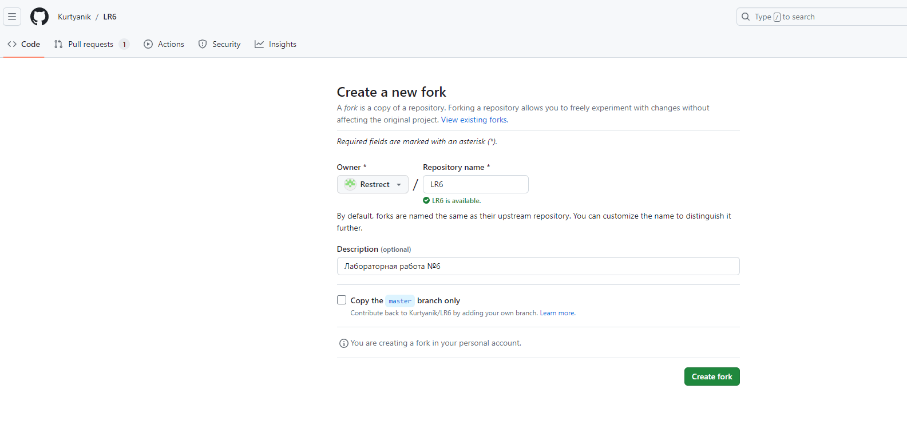
# Настройка клиента git и клонирование личного удалённого репозитория на компьютер
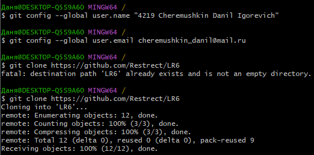
# Добавление файла через интерфейс GitHub
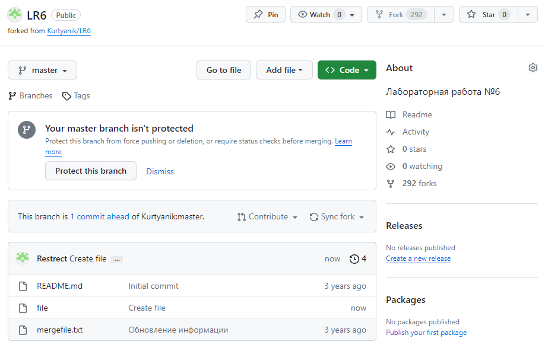
# Получение истории операций ветки master
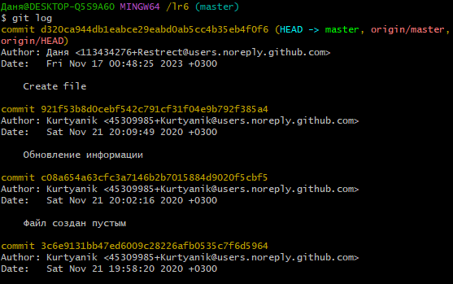
# Получение истории операций ветки branch1
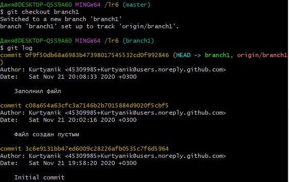
# Конфликт при попытке слияния
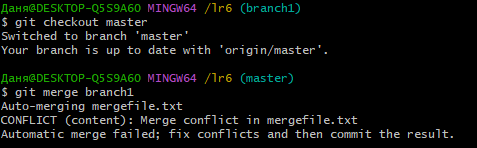
# Слияние ветки branch1 в ветку master
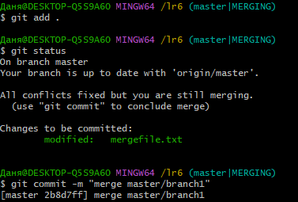
# Содержание файла mergefile.txt с конфликтующими данными
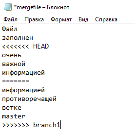
# Разрешение конфликта
Были удалены конфликтующие данные в файле mergefile.txt
br/
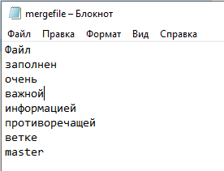
# Удаление побочной ветки

# Создание коммитов
Создание коммитов происходит для будущего их отката
br/
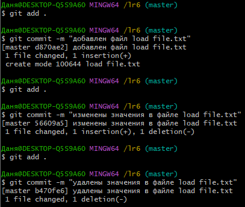
# Откат коммита на локальном и удалёном компьютере
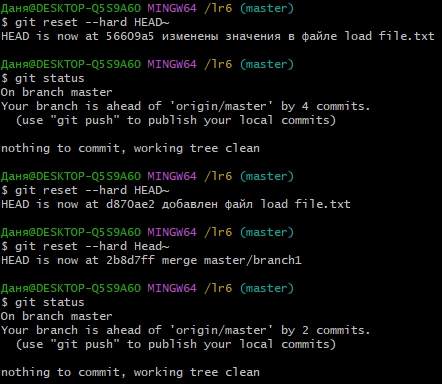
# Создание ветки для отчета
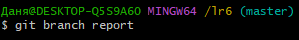
# Переключение на ветку для отчета и добавление скриншотов
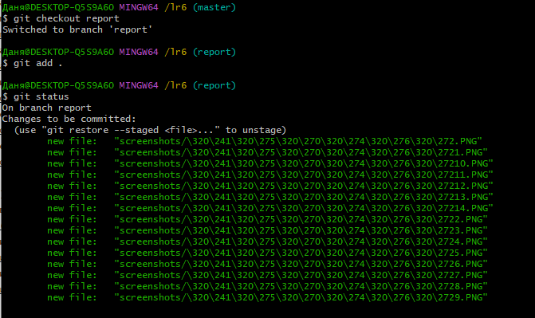
# Создание папки с изображениями в ветке удалённого репозитория
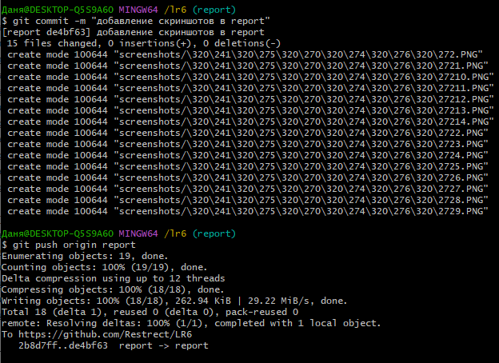
# Лог команд
Показана история команд
br/
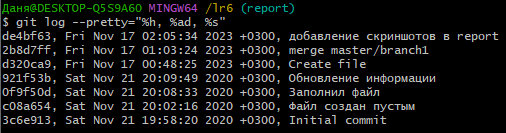
# Вывод
Изучены базовые возможности системы управления версиями, получен опыт работы с Git Api и опыт работы с локальным и удаленным репозиторием
